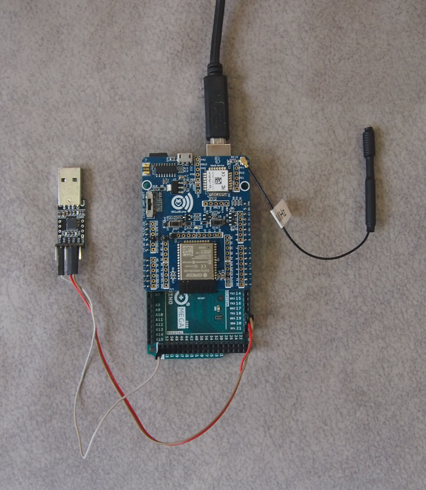
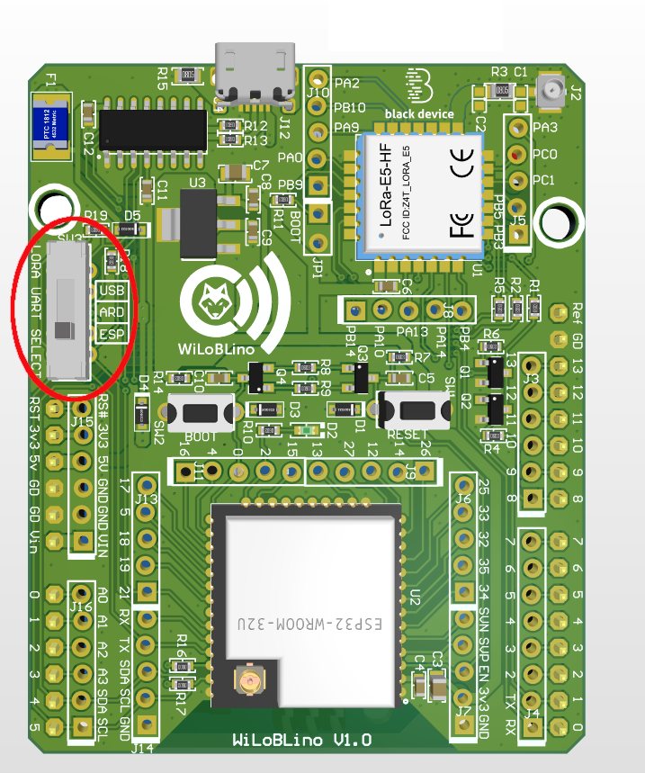
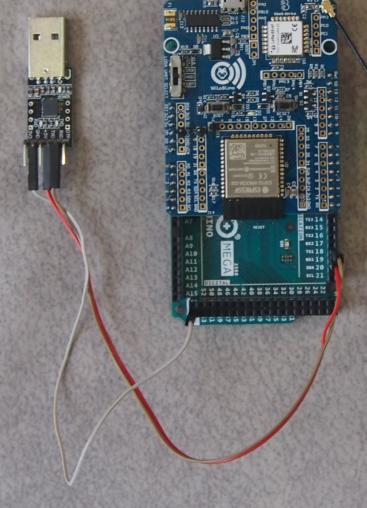

# Arduino Mega with WiLoBLino board as hat

In this example, you can see how the library works running in a Arduino Mega board. We use a [WiLoBLino board](https://blackdevice.com/producto/wiloblino/) as hat. You can get more info about this board in the [example with Wiloblino as stand-alone board](../wiloblino_board/).

In this case, we'll use only the Wio-E5 module of the hat. Please, take care with the position of the hat when it would be mounted over Arduino MEGA board.

Because of the multiple combinations of use of this board, it important to have a clear idea about how the serial port is shared between the different components.

If you are testing with a Wio-E5 but a different hat, you can avoid the explanations about the Wiloblino configuration, but anyway, take care about the Serial port you'll use to connect with the module.

## Powerup and serial connection
The simpliest way to test this example is to connect with an USB wire the Arduino Mega board to the computer. The hat will be feed by the Arduino's board. 

To connect the USB virtual serial port of the computer with the Arduino board, please, check the next section to understand how to select the right combination of the serial port connection between modules.

## Serial port selection
The Wiloblino board has a switch (SW3) that let's you select the way the UART of the Wio-E5 module is connected: 

* **ESP** Connects the Wio-E5 module to the ESP32 module
* **ARD** Connects Wio-E5 module to the Arduino motherboard pins. This position also connects the USB port of the Wiloblino board to ESP32 module
* **USB** Connects the Wio-E5 module to the USB port. This is very useful because Wio-E5 module is programmable

## Loading a sketch to Arduino MEGA
Due to the sharing Wio-E5 UART connection in Wiloblino board, this steps are critical to load and run the sketch in the ATMEGA microcontroller:

1. Set `SW3` in **USB** position (top in the image). This mode let's you communicate the Arduino motherboard UART with the USB serial port of the computer.

2. Load the sketch from your favourite IDE.

3. If your sketch uses the Wio-E5 module (as this example does), you must change `SW3` to **ARD** position (middle in the picture) to physically connect the ATMEGA UART to LoRa UART.

## Debugging
Because the Wiloblino hat uses the default Serial Port of the Arduino MEGA, you must use a different Serial Port to debug your applicaction. You will need an USB-ttl converter if you want to watch the messages from a console in your computer.

In this example, we use `Serial1` port to debug. As you can see in the next image, pins you'll need are `19` (RX1) and `18`(TX1). You must connect RX1 board (19) to TX pin in the USB-TTL converter and TX1 board (18) to RX pin in the converter.

In this example, debugging port are configured to 115200 bps

## Example code
This simple code shows how to send and receive frames over a LoRaWan network. It sends the value of a simple counter each minute in JSON format.

A LoRaWan gateway access is required to test this sketch. Change the App EUI, Device EUI and App Key at your discretion to fit to your network infrastructure.
