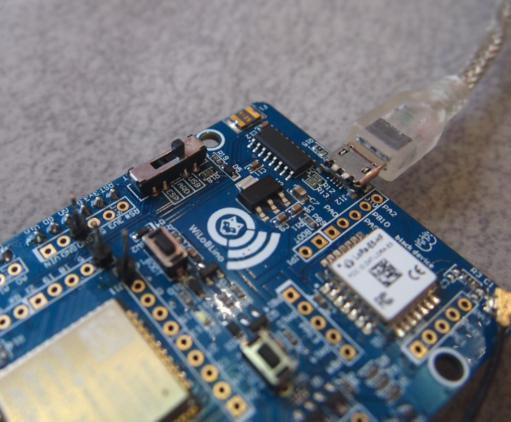
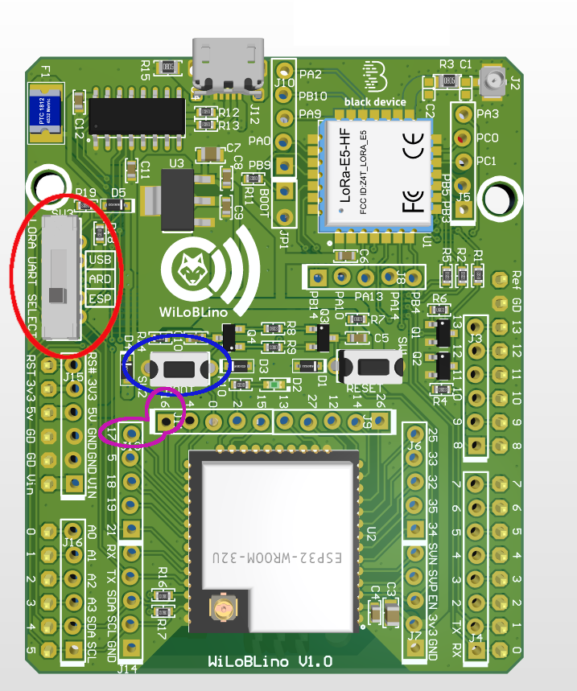
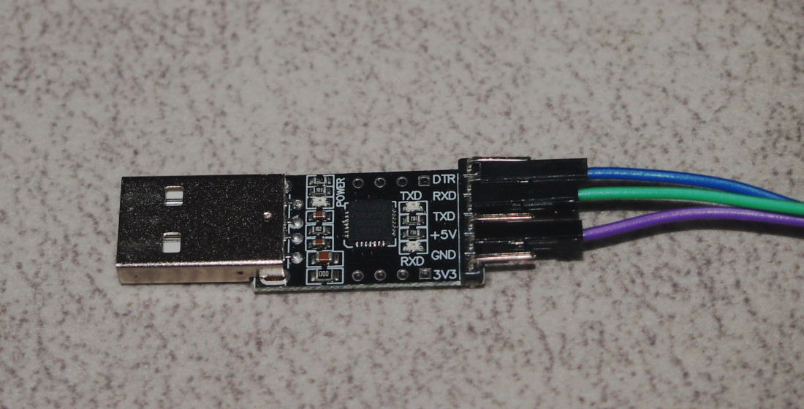
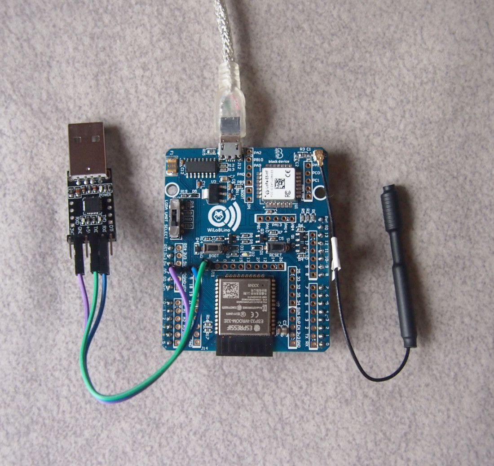

# WiLoBLino board example

WiLoBLino is a development board with an ESP32 and a Wio-E5 module. It can work as a stand-alone board or as a hat for multiple Arduino boards.
It uses an USB serial port to communicate with the different devices of the board.
Because the serial USB port is shared, it is important to take care the way you program and run the program in this board. 

## Powerup and serial connection
This board, in it's stand-alone mode must be powered by it's Micro-USB socket. This socket implements a serial port used as interface to the Wio-E5 module or to the ESP32 module

## LoRa UART selection
The board has a switch (`SW3`) that let's you select the way the UART of the Wio-E5 module is connected (check red highlighted zone):

* **ESP** Connects the Wio-E5 module to the default serial UART ESP32 module
* **ARD** Connects Wio-E5 module to the external default UART Arduino pins. This position also connects the USB port to default UART of the ESP32 module
* **USB** Connects the Wio-E5 module to the USB port. This is very useful because Wio-E5 module is programmable

## Loading the sketch in the ESP32
Due to the sharing Wio-E5 UART connection, this steps are critical to load and run the sketch in the ESP32 SoC:
1. Set `SW3` in **ARD** position (middle). This mode let's you communicate the ESP32 module UART with the USB serial port.

2. Load the sketch from your favourite IDE. If the upload doesn't begin, try to push **BOOT** switch (`SW2`) -check blue highlighted zone- while `Conecting...` text appears in the console.

3. If your sketch uses the Wio-E5 module (as this example does), you must change `SW3` to **ESP** position (bottom in the picture) to physically connect the ESP32 UART to LoRa UART.

## Debugging
In case you use the default UART in your ESP32 module to connect to Wio-E5, you can use `Serial2` to debug your code. You will need an USB-ttl converter.

Pins you'll need are `16` (RX) and `17`(TX) -check magenta highlighted zone-. You must connect RX board (16) to TX pin in the USB-TTL converter and TX board (17) to RX pin in the converter.

In this example, debugging port are configured to 115200 bps

## Example code
This simple code shows how to send and receive frames over a LoRaWan network. It sends the value of a simple counter each minute in JSON format.

A LoRaWan gateway access is required to test this sketch. Change the App EUI, Device EUI and App Key at your discretion to fit to your network infrastructure.

